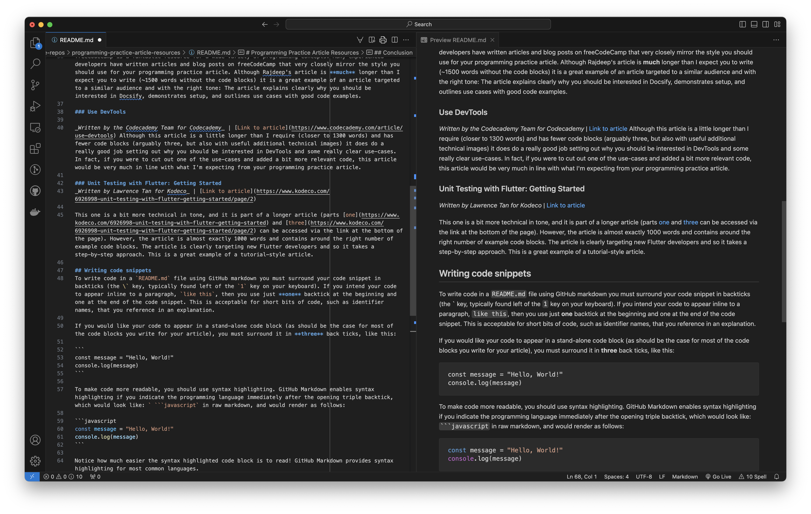

# Programming Practice Article Resources
_A repository containing resources and strategies that you can use in the development of your programming practice article._

## Introduction
This repository is intended as both a guide and a collection of resources that you can use in the development of your programming practice article, and also as a reference for [GitHub Markdown](https://docs.github.com/en/get-started/writing-on-github/getting-started-with-writing-and-formatting-on-github/quickstart-for-writing-on-github). Pay close attention to the formatting used in this `REAMDE.md` file so that you have an idea how to format your own article (whether written in markdown or using a different editor or approach). 

Let's review the goals and criteria for the programming practice article:

### Objective
To write a compelling blog/article on one of the following topics:
- Platform programming and development.
- Documentation processes.
- Code review practices.
- Refactoring practices.
- Code testing approaches.

### Criteria
_More details can be found on Brightspace._
- Include around 1000 words of text.
- Have a well-defined value for a potential future learner in this course.
- Include an introduction and conclusion.
- Include at least six multi-line blocks of example code.
- Include proper in-text citations (you can use GitHub Markdown footnotes[^1] to accomplish this, if you like).
- Include a properly formatted bibliography or reference list (potentially connected to footnote links, but any citation format, such as [APA](https://library.nic.bc.ca/mla_guide) or [MLA](https://library.nic.bc.ca/apa7th/home) is appropriate).

## Some example articles
The most important thing to remember is that your audience is potential future students in DGL 104. This means you can assume your reader has about the same level of experience in programming as someone who has recently completed CPS 100 (our Java programming course), and has knowledge of common programming concepts, such as variables, data collections, control flow, functions, objects, classes and basic object-oriented programming.

You are free to write your article as an informative/informational article, as a blog-style personal reflection, or as a tutorial. No matter which approach you choose, you **must** include code snippets (see [some examples](#writing-code-snippets) below).

Here are some example articles that you can model your own article on:

### How to Write Good Documentation with Docsify
_Written by Rajdeep Singh for freeCodeCamp_ | [Link to article](https://www.freecodecamp.org/news/how-to-write-good-documentation-with-docsify/)

freeCodeCamp is a fantastic resource for a wide variety of programming concepts. Many experienced developers have written articles and blog posts on freeCodeCamp that very closely mirror the style you should use for your programming practice article. Although Rajdeep's article is **much** longer than I expect you to write (~1500 words without the code blocks) it is a great example of an article targeted to a similar audience and with the right tone: The article explains clearly why you should be interested in Docsify, demonstrates setup, and outlines use cases with good code examples.

### Use DevTools

_Written by the Codecademy Team for Codecademy_ | [Link to article](https://www.codecademy.com/article/use-devtools) Although this article is a little longer than I require (closer to 1300 words) and has fewer code blocks (arguably three, but also with useful additional technical images) it does do a really good job setting out why you should be interested in DevTools and some really clear use-cases. In fact, if you were to cut out one of the use-cases and added a bit more relevant code, this article would be very much in line with what I'm expecting from your programming practice article.

### Unit Testing with Flutter: Getting Started
_Written by Lawrence Tan for Kodeco_ | [Link to article](https://www.kodeco.com/6926998-unit-testing-with-flutter-getting-started/page/2) 

This one is a bit more technical in tone, and it is part of a longer article (parts [one](https://www.kodeco.com/6926998-unit-testing-with-flutter-getting-started) and [three](https://www.kodeco.com/6926998-unit-testing-with-flutter-getting-started/page/2) can be accessed via the link at the bottom of the page). However, the article is almost exactly 1000 words and contains around the right number of example code blocks. The article is clearly targeting new Flutter developers and so it takes a step-by-step approach. This is a great example of a tutorial-style article.

## Writing code snippets 
To write code in a `README.md` file using GitHub markdown you must surround your code snippet in backticks (the \` key, typically found left of the `1` key on your keyboard). If you intend your code to appear inline to a paragraph, `like this`, then you use just **one** backtick at the beginning and one at the end of the code snippet. This is acceptable for short bits of code, such as identifier names, that you reference in an explanation.

If you would like your code to appear in a stand-alone code block (as should be the case for most of the code blocks you write for your article), you must surround it in **three** back ticks, like this:

```
const message = "Hello, World!"
console.log(message)
```

To make code more readable, you should use syntax highlighting. GitHub Markdown enables syntax highlighting if you indicate the programming language immediately after the opening triple backtick, which would look like: ` ```javascript` in raw markdown, and would render as follows:

```javascript
const message = "Hello, World!"
console.log(message)
```

Notice how much easier the syntax highlighted code block is to read! GitHub Markdown provides syntax highlighting for most common languages.

## Conclusion
You'll get the most value out of this guide if you clone it to your harddrive and open up the `README.md` in [Visual Studio Code](https://code.visualstudio.com/) (or a similar editor). VSCode allows you to edit a markdown file in one tab and have the rendered markdown displayed side-by-side in another tab, as pictured below: 



Doing so will allow you to examine the markdown syntax and the rendered code simultaneously. Note though that VSCode doesn't render all markdown exactly the same as GitHub will, so it's worth double-checking after you push. 

Hopefully you've found this guide useful and instructive! As a little bonus to those of you who have read this far: I did make some **intentional** mistakes throughout this document - I think four or five?. Bonus points available to the first students to successfully open a pull request to fix a mistake (keep it to one fix per student per pull request, please!)

---

[^1]: A footnote! Cool!